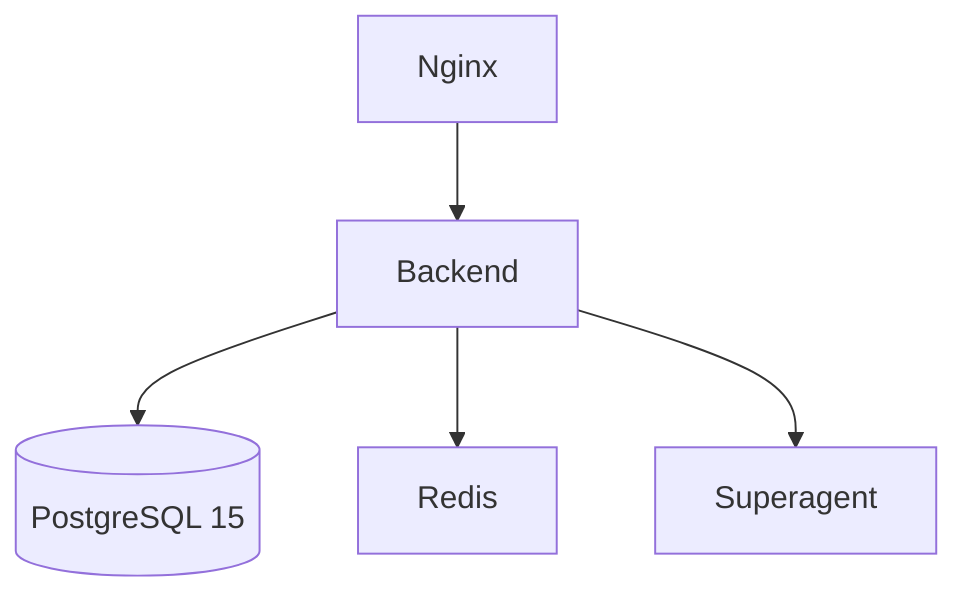

# Gaigentic

Gaigentic is a multi-tenant backend built with FastAPI. It integrates with the
Superagent service and stores configuration in PostgreSQL.

## Local development

Start the stack. Docker Compose now pulls the Superagent service directly from
GitHub using the `main:libs/superagent` subdirectory, so no manual clone is
required:

```bash
cp .env.development .env
docker compose build superagent
docker compose up -d
```

You can also run the convenience script which performs the above steps
automatically:

```bash
./setup_superagent.sh
```

The API will be available at `http://localhost:8001` and the health check at
`/healthz`.

## Production deployment

Build the frontend and launch the production stack:

```bash
(cd frontend && npm install && npm run build)
docker-compose -f docker-compose.prod.yml up --build
```

## Environment variables

| Variable | Description |
| -------- | ----------- |
| `DATABASE_URL` | Database connection string |
| `SUPERAGENT_URL` | URL to Superagent service |
| `APP_ENV` | `development` or `production` |
| `OPENAI_API_KEY` | API key for LLM access |
| `LLM_PROVIDER` | Provider name (default `openai`) |
| `LLM_MODEL` | Model identifier |
| `JWT_SECRET_KEY` | Secret used for JWT tokens |
| `JWT_ALGORITHM` | JWT algorithm |
| `CORS_ORIGINS` | Comma separated list of allowed origins |
| `RATE_LIMIT_PER_MINUTE` | Requests per minute before 429 |
| `LOG_FILE` | Path to log file in production |

## Architecture


